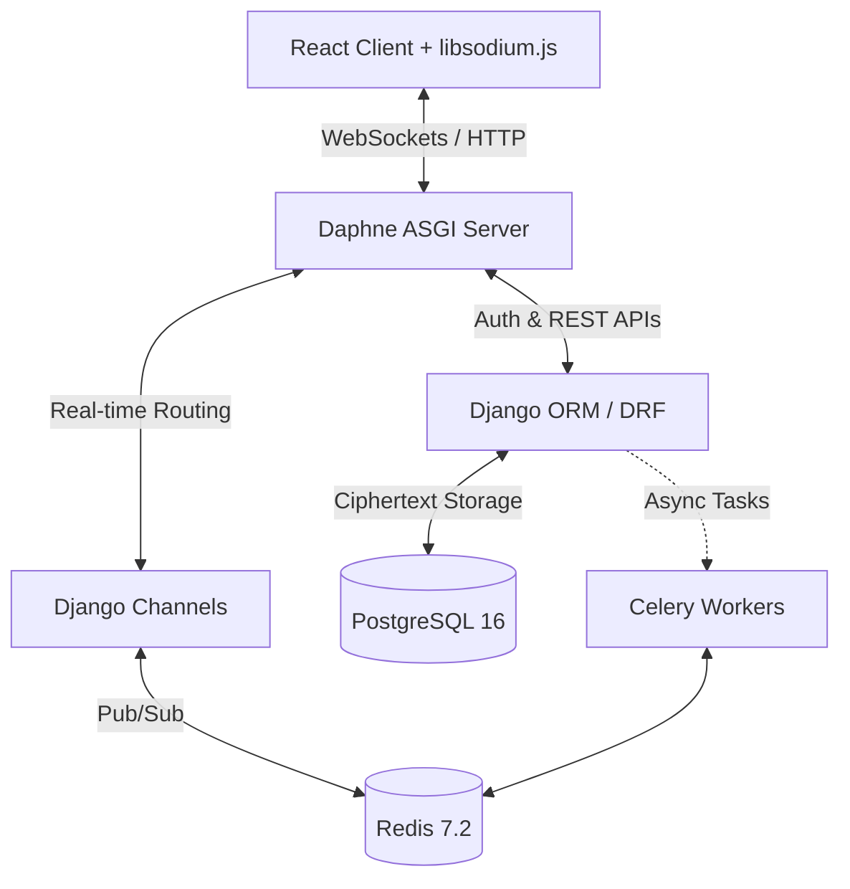

<div align="center">
  
  <h1>🌙 NightChat</h1>
  <p><strong>Production-Grade Real-Time E2E Encrypted Chat Application</strong></p>

  [](https://www.djangoproject.com/)
  [](https://reactjs.org/)
  [](https://www.postgresql.org/)
  [](https://redis.io/)
  [](https://libsodium.gitbook.io/doc/)
  [](https://opensource.org/licenses/MIT)

  <p align="center">
    <a href="#-key-features">Features</a> •
    <a href="#-architecture">Architecture</a> •
    <a href="#-tech-stack">Tech Stack</a> •
    <a href="#-security-zero-trust-model">Security</a> •
    <a href="#-getting-started">Getting Started</a> •
    <a href="#-contributing">Contributing</a>
  </p>
</div>

---

**NightChat** is a highly scalable, real-time chat application built with **Django Channels** and **React**. Designed from the ground up with a **Zero-Knowledge Architecture**, it delivers instantaneous messaging capabilities (under 100ms latency) while guaranteeing absolute privacy through strict End-to-End (E2E) encryption. The server acts purely as a relayer and ciphertext store — it never sees your plaintext.

---

## ✨ Key Features

*   **⚡ Sub-100ms Real-Time Delivery**: Blazing fast bi-directional communication powered by Django Channels, Daphne, and Redis.
*   **🔒 Absolute Privacy (E2E Encryption)**: Client-side encryption using `libsodium` (X25519 + XSalsa20-Poly1305). The server only stores `bytea` ciphertext.
*   **👥 Scalable Group Chats**: Seamlessly handles private 1-on-1 conversations and massive group chats with up to 1,000 members.
*   **📎 Secure Media Sharing**: Encrypted file attachments with support for payloads up to 100MB, stored securely.
*   **🌐 Seamless Integration**: Features Google OAuth2 integration for frictionless onboarding and contact synchronization.
*   **📈 Built for Scale**: Architected to comfortably support ~10,000 concurrent WebSocket connections with horizontal scalability.
*   **🎨 Premium UI/UX**: A highly responsive, modern glassmorphic interface built with React, Vite, and Tailwind CSS.

---

## 🏗️ Architecture

NightChat employs a decoupled, service-oriented architecture optimized for real-time WebSocket traffic and heavy cryptographic workloads.



1.  **Client-Side**: Generates ephemeral and persistent encryption keys. All cryptographic operations occur in the browser.
2.  **WebSocket Layer**: Daphne terminates the WebSocket connections and passes them to Django Channels.
3.  **Persistence Layer**: PostgreSQL 16 securely stores binary ciphertext using optimized `bytea` columns.
4.  **Asynchronous Layer**: Celery handles heavy lifting like background notifications, media processing, and transcriptions without blocking the main event loop.

---

## 🛠️ Tech Stack

### 🔙 Backend (Core)
| Component | Technology | Rationale |
| :--- | :--- | :--- |
| **Framework** | Django 4.2 LTS | Rock-solid foundation, robust ORM. |
| **Real-Time** | Django Channels 4.1+ | Native ASGI WebSocket handling. |
| **ASGI Server** | Daphne | High-concurrency protocol server. |
| **REST API** | DRF + SimpleJWT | Stateless token-based authentication. |
| **Task Queue** | Celery + Redis | Asynchronous job execution. |

### 🎨 Frontend
| Component | Technology | Rationale |
| :--- | :--- | :--- |
| **Framework** | React 18 (Vite) | Lightning-fast HMR and modern UI rendering. |
| **State** | Zustand | Zero-boilerplate, high-performance state management. |
| **Styling** | Tailwind CSS | Utility-first styling for rapid UI development. |
| **Crypto** | `libsodium.js` | WebAssembly-backed client-side cryptography. |

### 🗄️ Infrastructure & Data
| Component | Technology | Rationale |
| :--- | :--- | :--- |
| **Primary DB** | PostgreSQL 16 | ACID compliance, `bytea`, and `tsvector`. |
| **In-Memory** | Redis 7.2 | Channel layer backplane and rapid caching. |
| **Deployment** | Docker & Compose | Deterministic, containerized environments. |

---

## 🛡️ Security: Zero Trust Model

NightChat operates on a strict **Zero Trust** principle. The server is considered an untrusted environment.

*   **Key Exchange**: Perfect Forward Secrecy (PFS) powered by **X25519 Diffie-Hellman** key agreement.
*   **Symmetric Encryption**: Message payloads are encrypted using the authenticated encryption cipher **XSalsa20-Poly1305**.
*   **Ciphertext Only**: The database schema enforces security by only accepting binary blobs (`bytea`). The backend logic is intentionally unaware of message contents.
*   **Authentication**: Passwords (where applicable) are hashed using **Argon2**, currently the strongest available key derivation function.

---

## 🚀 Getting Started

### Prerequisites
*   [Docker](https://www.docker.com/) & [Docker Compose](https://docs.docker.com/compose/)
*   *(Optional)* [Node.js](https://nodejs.org/) 18+ and [Python](https://www.python.org/) 3.10+ for manual local development.

### 🐳 Quick Start (Docker - Recommended)

The fastest way to get NightChat running is via Docker.

1.  **Clone the repository:**
    ```bash
    git clone https://github.com/J0KEEER/Django-Project-NightChat.git
    cd Django-Project-NightChat
    ```

2.  **Set up environment variables:**
    ```bash
    cp .env.example .env
    # Edit .env with your specific configurations (e.g., Google OAuth credentials)
    ```

3.  **Spin up the infrastructure:**
    ```bash
    docker-compose up --build
    ```

    *   **Backend API & WebSockets**: `http://localhost:8000`
    *   **Frontend UI**: `http://localhost:5173`

### 💻 Manual Local Development

If you prefer to run the services bare-metal for development:

**1. Backend Setup**
```bash
cd server
python3 -m venv venv
source venv/bin/activate
pip install -r requirements.txt

# Run migrations and start the ASGI server
python manage.py migrate
python manage.py runserver
# Or optimally: daphne -p 8000 config.asgi:application
```

**2. Frontend Setup**
```bash
cd client
npm install
npm run dev
```

---

## 📁 Project Structure

```text
NightChat/
├── client/                 # React SPA (Vite, Zustand, Tailwind)
├── server/                 # Django ASGI Application
│   ├── apps/               # Modular Django apps:
│   │   ├── accounts/       # User auth, JWT, Google OAuth
│   │   ├── chat/           # WebSocket consumers, Channels logic
│   │   └── contacts/       # Roster management
│   ├── config/             # Root routing, ASGI/WSGI entrypoints
│   └── settings/           # Environment-specific settings
├── docker-compose.yml      # Multi-container orchestration
└── README.md               # You are here!
```

---

## 🤝 Contributing

Contributions are what make the open-source community such an amazing place to learn, inspire, and create. Any contributions you make are **greatly appreciated**.

1. Fork the Project
2. Create your Feature Branch (`git checkout -b feature/AmazingFeature`)
3. Commit your Changes (`git commit -m 'Add some AmazingFeature'`)
4. Push to the Branch (`git push origin feature/AmazingFeature`)
5. Open a Pull Request

---

## 📄 License

Distributed under the MIT License. See `LICENSE` for more information.

---

<div align="center">
  <p>Built with ❤️ by <a href="https://github.com/J0KEEER">J0KEEER</a> & Contributors</p>
</div>
